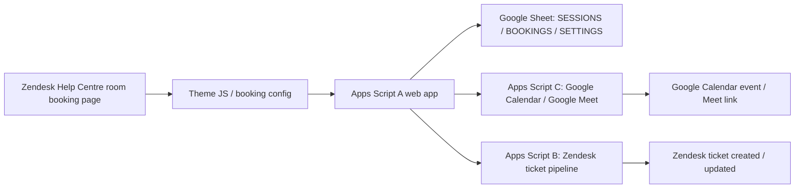

# Internal Technical Pack

## Digify Room Booking Integration

Status: Internal replication document  
Last updated: 2026-03-25  
Current theme build: `2027.0.10`  
Current Zendesk build marker: `2026-03-25-01`

## 1. Purpose

This document is the replication pack for the Digify room-booking solution. It is not a summary deck. It is the operational document used to:

- understand what the solution does
- redeploy the current pilot cleanly
- onboard a new client without re-engineering the core flow
- identify which values are stable and which must be replaced per client
- troubleshoot the known failure modes
- hand the solution over to a shared owner

## 2. What The Solution Does

The solution gives Zendesk Help Centre users a booking UI for:

- `Training Room 1`
- `Training Room 2`
- `Interview Room` / `Meeting Room`

The UI loads availability from a Google Apps Script web app, writes bookings into a Google Sheet, creates Zendesk tickets for those bookings, and optionally generates a Google Meet link for hybrid bookings.

Core functional rules:

- training rooms: `08:00-20:00`, `30` minute slots
- interview room: `12:00-20:00`, `60` minute slots
- booking source of truth: Google Sheet `BOOKINGS`
- Help Centre frontend uses JSONP/fetch-safe Apps Script calls
- Zendesk ticket creation is handled server-side by Apps Script, not by the browser

## 3. Source Of Truth Links

### Live / Current Pilot

- Repo: [https://github.com/MrMoneyDeveloper/Digified](https://github.com/MrMoneyDeveloper/Digified)
- Zendesk live booking page: [https://cxe-internal.zendesk.com/hc/en-us/p/room_booking](https://cxe-internal.zendesk.com/hc/en-us/p/room_booking)
- Google Sheet: [https://docs.google.com/spreadsheets/d/1FqFxTGqsAc0yhGSdp0XJidoFS1DPIXglSk6wo_PtqbU/edit](https://docs.google.com/spreadsheets/d/1FqFxTGqsAc0yhGSdp0XJidoFS1DPIXglSk6wo_PtqbU/edit)
- Apps Script editor: [https://script.google.com/home/projects/11hpmxTuxmdnTVi-lHdreRUwv-Qdkaz7-HZkXahfsthM_3GG1zmKJgaWu/edit](https://script.google.com/home/projects/11hpmxTuxmdnTVi-lHdreRUwv-Qdkaz7-HZkXahfsthM_3GG1zmKJgaWu/edit)
- Apps Script web app: [https://script.google.com/macros/s/AKfycbwLge7qDCPemVqE2MsmB11HTZBOJcjFWYjj5yNLGzXKh_qVieGo8Yf5QWVTqt7xB_FU/exec](https://script.google.com/macros/s/AKfycbwLge7qDCPemVqE2MsmB11HTZBOJcjFWYjj5yNLGzXKh_qVieGo8Yf5QWVTqt7xB_FU/exec)

### Internal Reference Link

- Google Doc link: `REQUIRED - add the shared internal implementation/handover Google Doc URL here`

This link is not discoverable from the repo and must be maintained by the delivery owner.

## 4. System Flow



Operational flow:

1. User opens the Zendesk custom page.
2. Theme JS requests sessions from Script A.
3. Script A reads slot rules plus sheet state.
4. User submits booking.
5. Script A validates overlap, writes booking row, and optionally calls Script C.
6. Script C creates a calendar event and Meet link for hybrid bookings.
7. Script B reads pending bookings and creates Zendesk tickets.
8. Zendesk-side triggers/automations send confirmation and solve or route the ticket.

## 5. Component Inventory

### Zendesk Theme Repo

- Root repo: `C:\Workspace\Digified`
- Primary frontend config: `C:\Workspace\Digified\assets\booking-config.js`
- Room booking page: `C:\Workspace\Digified\templates\custom_pages\room_booking.hbs`
- Training booking page: `C:\Workspace\Digified\templates\custom_pages\training_booking.hbs`
- Room booking JS: `C:\Workspace\Digified\assets\room-bookings-calendar.js`
- Training booking JS: `C:\Workspace\Digified\assets\training-bookings-calendar.js`
- Header/navigation: `C:\Workspace\Digified\templates\header.hbs`
- Theme settings schema: `C:\Workspace\Digified\settings_schema.json`
- Theme manifest: `C:\Workspace\Digified\manifest.json`
- Deployment/build marker: `C:\Workspace\Digified\templates\document_head.hbs`

### Apps Script Project

All three scripts currently live in the same Apps Script project:

- Script A: `C:\Workspace\Digified\apps_scripts\scriptA.gs`
- Script B: `C:\Workspace\Digified\apps_scripts\scriptB.gs`
- Script C: `C:\Workspace\Digified\apps_scripts\scriptC.gs`

### Google Sheet Tabs

- `SESSIONS`: optional slot overrides
- `BOOKINGS`: booking source of truth
- `SETTINGS`: deployment and API key metadata
- `LOGS`: Script B pipeline logs
- `FAILED_QUEUE`: Script B retry queue

## 6. Current Pilot Configuration

### 6.1 Theme Build And Packaging

- Theme version: `2027.0.10`
- Build marker: `2026-03-25-01`
- Build marker source: `C:\Workspace\Digified\templates\document_head.hbs:2`
- Room page build marker: `C:\Workspace\Digified\templates\custom_pages\room_booking.hbs:1`
- Current distributable zip: `C:\Workspace\Digified\digified-theme.zip`

Packaging rule:

- use `C:\Workspace\Digified\package-theme.ps1`
- do not use Windows `Compress-Archive`
- do not rely on `digified-theme-export.zip` for the room-booking deployment

Reference:

- `C:\Workspace\Digified\README.md`

### 6.2 Current Web App URL

Current active web app URL:

- [https://script.google.com/macros/s/AKfycbwLge7qDCPemVqE2MsmB11HTZBOJcjFWYjj5yNLGzXKh_qVieGo8Yf5QWVTqt7xB_FU/exec](https://script.google.com/macros/s/AKfycbwLge7qDCPemVqE2MsmB11HTZBOJcjFWYjj5yNLGzXKh_qVieGo8Yf5QWVTqt7xB_FU/exec)

Code references:

- `C:\Workspace\Digified\apps_scripts\scriptA.gs:18`
- `C:\Workspace\Digified\assets\booking-config.js:12`
- `C:\Workspace\Digified\assets\room-bookings-calendar.js:60`
- `C:\Workspace\Digified\templates\custom_pages\room_booking.hbs:5`
- `C:\Workspace\Digified\templates\custom_pages\training_booking.hbs:823`

### 6.3 Script Properties

Current known pilot properties:

| Property | Current pilot value | Notes |
| --- | --- | --- |
| `TRAINING_SHEET_ID` | `1FqFxTGqsAc0yhGSdp0XJidoFS1DPIXglSk6wo_PtqbU` | Main spreadsheet used by Script A and Script B |
| `MEET_CALENDAR_ID` | `primary` | Script C calendar target |
| `TRAINING_DEFAULT_TZ` | `Africa/Johannesburg` | Used by Script A and Script C |
| `TRAINING_API_KEY` | Generated and stored in script properties and `SETTINGS` sheet | Sensitive, rotate for new client |
| `ZD_SUBDOMAIN` | client-specific | Override Script B hardcoded fallback |
| `ZD_EMAIL` | client-specific | Zendesk API identity |
| `ZD_TOKEN` | client-specific | Zendesk API token |
| `ZD_BRAND_ID` | client-specific | Optional if single-brand |
| `ZD_TRAINING_FORM_ID` | client-specific | Zendesk form for booking tickets |
| `ZD_ALERT_FORM_ID` | client-specific | Optional alert path |
| `ZD_ALERT_REQUESTER_EMAIL` | client-specific | Optional |
| `ZD_ERROR_EMAIL_TO` | client-specific | Optional |

Important behavior:

- Script A reads `TRAINING_SHEET_ID` from `C:\Workspace\Digified\apps_scripts\scriptA.gs:27`
- Script B reads the same property from `C:\Workspace\Digified\apps_scripts\scriptB.gs:21`
- Script C reads `MEET_CALENDAR_ID` and `TRAINING_DEFAULT_TZ` from `C:\Workspace\Digified\apps_scripts\scriptC.gs:368` and `C:\Workspace\Digified\apps_scripts\scriptC.gs:381`

### 6.4 Linked Google Cloud Project

Current standard Cloud project for Meet/Calendar API work:

- Project name: `Digify Room Booking`
- Project number: `828721352429`

Current OAuth state:

- OAuth publishing status: `Testing`
- user type: `External`
- current test user: `digifycx@gmail.com`
- auto-generated Apps Script OAuth client exists

Important note:

- the Apps Script `Change project` dialog requires the project number `828721352429`
- do not paste the OAuth client ID there

### 6.5 APIs / Services Enabled

Required:

- Google Calendar API
- Google Meet API
- Apps Script advanced service: `Calendar`

Script C setup helpers:

- `setupScriptCProperties()` at `C:\Workspace\Digified\apps_scripts\scriptC.gs:982`
- `getScriptCSetupStatus()` at `C:\Workspace\Digified\apps_scripts\scriptC.gs:986`
- `authorizeScriptC()` at `C:\Workspace\Digified\apps_scripts\scriptC.gs:990`
- `diagnoseMeetAccessByLinkInput(link)` at `C:\Workspace\Digified\apps_scripts\scriptC.gs:1002`

### 6.6 Zendesk Objects Used

Theme-side:

- custom page slug: `room_booking`
- custom page slug: `home_internal`
- custom page slug: `home_tenant`
- theme settings:
  - `room_booking_api_url`
  - `room_booking_api_key`
  - `room_booking_api_mode`
  - `room_booking_iframe_url`
  - `room_booking_internal_tag`
  - `training_api_url`
  - `training_api_key`
  - `training_api_mode`
  - `training_iframe_url`
  - `training_booking_internal_tag`

References:

- `C:\Workspace\Digified\settings_schema.json:6`
- `C:\Workspace\Digified\settings_schema.json:52`
- `C:\Workspace\Digified\manifest.json:877`
- `C:\Workspace\Digified\manifest.json:917`

Zendesk pipeline:

- required Zendesk tag: `training-room-booking`
- custom field: booking ID field `24568268312988`
- Zendesk API endpoint pattern: `https://{subdomain}.zendesk.com/api/v2/tickets.json`

References:

- `C:\Workspace\Digified\apps_scripts\scriptB.gs:37`
- `C:\Workspace\Digified\apps_scripts\scriptB.gs:59`
- `C:\Workspace\Digified\apps_scripts\scriptB.gs:752`

## 7. Setup Steps

### 7.1 Repo And Theme

1. Clone the repo.
2. Confirm the repo remote is correct.
3. Confirm the theme version in `C:\Workspace\Digified\manifest.json`.
4. Confirm the build marker in `C:\Workspace\Digified\templates\document_head.hbs`.
5. Build the uploadable theme zip using:

```powershell
powershell -ExecutionPolicy Bypass -File .\package-theme.ps1
```

6. Upload or GitHub-sync the theme.
7. Publish the theme.

### 7.2 Apps Script Project

1. Open the Apps Script project.
2. Confirm Script A, Script B, and Script C are present.
3. In Project Settings, set the required script properties.
4. If Meet API access is required, link the Apps Script project to the standard GCP project `828721352429`.
5. Enable:
   - Google Calendar API
   - Google Meet API
   - Apps Script advanced service `Calendar`

### 7.3 Script A Bootstrapping

Run the web app init endpoint once:

- [https://script.google.com/macros/s/AKfycbwLge7qDCPemVqE2MsmB11HTZBOJcjFWYjj5yNLGzXKh_qVieGo8Yf5QWVTqt7xB_FU/exec?action=init](https://script.google.com/macros/s/AKfycbwLge7qDCPemVqE2MsmB11HTZBOJcjFWYjj5yNLGzXKh_qVieGo8Yf5QWVTqt7xB_FU/exec?action=init)

What this does:

- creates/normalizes `SESSIONS`, `BOOKINGS`, and `SETTINGS`
- writes `DEPLOYMENT_ID` and `WEBAPP_URL`
- generates or syncs `TRAINING_API_KEY`

Reference:

- `C:\Workspace\Digified\apps_scripts\scriptA.gs:178`

### 7.4 Script B Pipeline

Run these in order:

1. `setupScriptB()`
2. `testSheetLocation()`
3. `initZendeskPipeline()`
4. `repairBookingsZendeskColumns()`
5. `createZendeskTrigger()`

Reference functions:

- `C:\Workspace\Digified\apps_scripts\scriptB.gs:77`
- `C:\Workspace\Digified\apps_scripts\scriptB.gs:88`
- `C:\Workspace\Digified\apps_scripts\scriptB.gs:155`
- `C:\Workspace\Digified\apps_scripts\scriptB.gs:224`
- `C:\Workspace\Digified\apps_scripts\scriptB.gs:194`

### 7.5 Script C Setup

Run these in order:

1. `setupScriptCProperties()`
2. `authorizeScriptC()`
3. `getScriptCSetupStatus()`
4. `diagnoseMeetAccessByLinkInput(link)` when validating Meet access behavior

Reference:

- `C:\Workspace\Digified\apps_scripts\scriptC.gs:982`
- `C:\Workspace\Digified\apps_scripts\scriptC.gs:990`
- `C:\Workspace\Digified\apps_scripts\scriptC.gs:986`
- `C:\Workspace\Digified\apps_scripts\scriptC.gs:1002`

### 7.6 Zendesk Guide Objects

Create or confirm:

- custom page `room_booking`
- custom page `home_internal`
- custom page `home_tenant`
- booking theme settings are present in Guide Admin
- live Help Centre routes users to the correct page

### 7.7 Validation

Minimum validation set:

1. load room availability page
2. submit one in-person booking
3. submit one hybrid booking
4. confirm booking row in Google Sheet
5. confirm Zendesk ticket creation
6. confirm `training-room-booking` tag on the ticket
7. confirm Meet link written for hybrid bookings
8. confirm booked slots return as unavailable on reload

## 8. What Must Be Replaced For A New Client

This section is the main copy/replace list.

### 8.1 Zendesk Identity And Credentials

Replace or override:

- `ZD_SUBDOMAIN`
- `ZD_EMAIL`
- `ZD_TOKEN`
- `ZD_BRAND_ID`
- `ZD_TRAINING_FORM_ID`
- `ZD_ALERT_FORM_ID`
- `ZD_ALERT_REQUESTER_EMAIL`
- `ZD_ERROR_EMAIL_TO`

Current hardcoded pilot fallback references:

- `C:\Workspace\Digified\apps_scripts\scriptB.gs:49`
- `C:\Workspace\Digified\apps_scripts\scriptB.gs:50`
- `C:\Workspace\Digified\apps_scripts\scriptB.gs:51`

Do not leave the pilot token/subdomain hardcoded for a new client. Override with script properties or replace the fallback values.

### 8.2 Zendesk Custom Field IDs

Replace:

- booking ID custom field `24568268312988`

Reference:

- `C:\Workspace\Digified\apps_scripts\scriptB.gs:59`

### 8.3 Help Centre Hostnames

Replace hardcoded `cxe-internal.zendesk.com` URLs in:

- `C:\Workspace\Digified\templates\header.hbs:80`
- `C:\Workspace\Digified\templates\header.hbs:82`

### 8.4 Theme Segmentation Values

Replace as required per tenant:

- `internal_org_id`
- `tenant_org_id`
- `internal_tag`
- `tenant_tag`
- `management_tag`
- `management_org_id`
- `internal_form_id`
- any external form IDs used in the tenant setup

References:

- `C:\Workspace\Digified\manifest.json:217`
- `C:\Workspace\Digified\manifest.json:224`
- `C:\Workspace\Digified\manifest.json:231`
- `C:\Workspace\Digified\manifest.json:238`
- `C:\Workspace\Digified\manifest.json:245`
- `C:\Workspace\Digified\manifest.json:252`
- `C:\Workspace\Digified\manifest.json:259`

### 8.5 Google Sheet / Calendar Ownership

Replace:

- `TRAINING_SHEET_ID`
- `MEET_CALENDAR_ID`
- `TRAINING_DEFAULT_TZ`

Rotate:

- `TRAINING_API_KEY`

### 8.6 Theme-Level Explicit API Wiring

Current pilot wiring is explicit in code. For a new client, replace the URL and rotate the key in all locations below:

- `C:\Workspace\Digified\assets\booking-config.js:12`
- `C:\Workspace\Digified\assets\booking-config.js:13`
- `C:\Workspace\Digified\assets\room-bookings-calendar.js:60`
- `C:\Workspace\Digified\assets\room-bookings-calendar.js:61`
- `C:\Workspace\Digified\templates\custom_pages\room_booking.hbs:5`
- `C:\Workspace\Digified\templates\custom_pages\room_booking.hbs:6`
- `C:\Workspace\Digified\templates\custom_pages\room_booking.hbs:45`
- `C:\Workspace\Digified\templates\custom_pages\room_booking.hbs:46`
- `C:\Workspace\Digified\templates\custom_pages\training_booking.hbs:823`
- `C:\Workspace\Digified\templates\custom_pages\training_booking.hbs:824`
- `C:\Workspace\Digified\templates\custom_pages\training_booking.hbs:855`
- `C:\Workspace\Digified\templates\custom_pages\training_booking.hbs:856`

## 9. Deployment Steps

### Apps Script Deployment

1. Save the Apps Script project.
2. Create a new version.
3. Deploy or update the web app.
4. Run `?action=init` once against the active `/exec` URL.
5. Confirm the `SETTINGS` sheet updates `DEPLOYMENT_ID` and `WEBAPP_URL`.

### Theme Deployment

1. Bump `C:\Workspace\Digified\manifest.json` version.
2. Update `C:\Workspace\Digified\templates\document_head.hbs` build marker.
3. Build `C:\Workspace\Digified\digified-theme.zip`.
4. Upload/publish or use Guide GitHub sync.
5. Confirm page source contains the new `BUILD_MARKER`.

### Known Deployment Rule

Use:

- `C:\Workspace\Digified\digified-theme.zip`

Do not rely on:

- `C:\Workspace\Digified\digified-theme-export.zip`

for the room-booking deployment path.

## 10. Troubleshooting

### Theme Looks Old / Changes Not Showing

Check:

- `manifest.json` version was bumped
- theme was published, not only imported
- page source contains the new build marker
- correct zip was uploaded

References:

- `C:\Workspace\Digified\README.md`
- `C:\Workspace\Digified\templates\document_head.hbs:2`

### Red API Error In Help Centre

Likely causes:

- stale theme settings overriding current web app URL
- JSONP timeout against a slow Apps Script response
- stale deployment URL still active in Help Centre

Current timeout references:

- `C:\Workspace\Digified\assets\training-bookings-calendar.js:43`
- `C:\Workspace\Digified\assets\room-bookings-calendar.js:558`

### Booked Slots Still Show As Open

Check:

- Script A is deployed from the latest source
- `TRAINING_SHEET_ID` points to the intended sheet
- `repairBookingWindowFields()` has been run
- `BOOKINGS` rows have valid `start_date`, `start_time`, `end_date`, `end_time`

Reference:

- `C:\Workspace\Digified\apps_scripts\scriptA.gs:2028`

### Meet Link Exists But Guests Wait For Admission

This is usually not a Zendesk problem. It is a Google Meet / GCP / OAuth problem.

Check:

- linked standard GCP project is correct
- Google Meet API enabled
- Google Calendar API enabled
- OAuth app has the operator as a test user
- `authorizeScriptC()` was run after project change

Key reference:

- `C:\Workspace\Digified\apps_scripts\scriptC.gs:660`

### OAuth Access Denied After Changing Project

Check:

- OAuth publishing status is `Testing`
- operator account is added as a test user
- Apps Script is using the project number, not the OAuth client ID
- wait a few minutes and retry if the test-user list was just updated

### Script B Cannot Find The Right Spreadsheet

Run:

- `testSheetLocation()`

Reference:

- `C:\Workspace\Digified\apps_scripts\scriptB.gs:88`

## 11. Ownership And Handover

Minimum handover target:

- shared Google account owns the Apps Script project
- shared Google account owns the spreadsheet
- standard GCP project is accessible by the delivery owner, not a personal-only login
- Zendesk admin credentials are stored in an approved internal vault, not only in script fallbacks
- repo access is shared with at least one secondary owner

Handover checklist:

1. confirm repo owner
2. confirm Apps Script owner
3. confirm spreadsheet owner
4. confirm GCP project owner
5. confirm Zendesk admin owner
6. confirm where secrets are stored
7. confirm who can redeploy theme
8. confirm who can redeploy Apps Script
9. confirm support contact for booking incidents

## 12. Operator Notes

- This pack should be updated whenever the web app URL, theme version, sheet ID, or linked GCP project changes.
- Do not remove the explicit API wiring from the theme unless the deployment model changes intentionally.
- If a new client is onboarded, duplicate this pack and replace only the client-specific values called out in Section 8.
